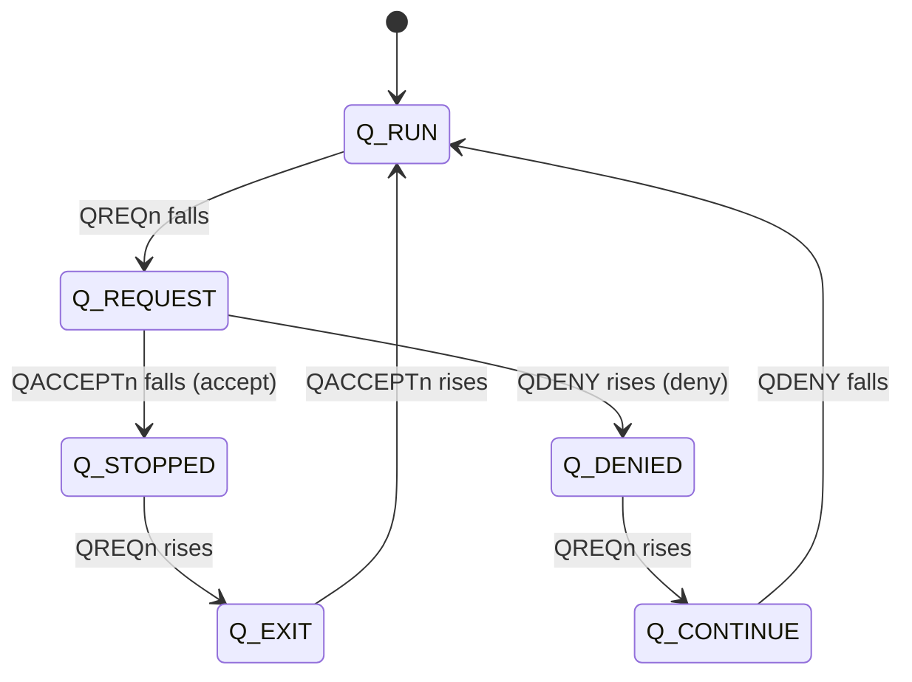
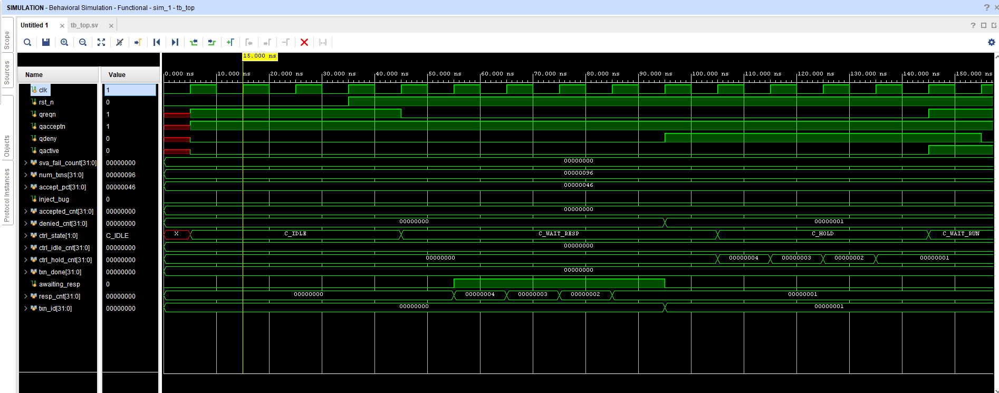
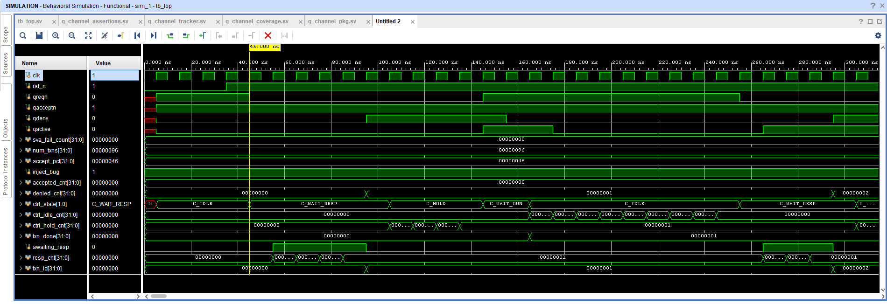

# Q-Channel Power-Management Tracker

A SystemVerilog verification project for the **AMBA Q-Channel** low-power
handshake. It replaces waveform-hunting with a readable log, catches protocol
violations with assertions, and measures how much of the protocol a test
exercised with a functional covergroup.

| Piece | File | What it does |
|---|---|---|
| Shared definitions | `rtl/q_channel_pkg.sv` | State enum, signal decoder, legal-transition table |
| **SVA checker** | `rtl/q_channel_assertions.sv` | 4 concurrent assertions that flag protocol violations |
| **Tracker** | `rtl/q_channel_tracker.sv` | Logs every signal change + state transition to a table |
| **Functional coverage** | `rtl/q_channel_coverage.sv` | Covergroup: toggles, states, transitions, cross |
| **Testbench** | `tb/tb_top.sv` | Clock/reset, clocked controller FSM, clocked device FSM |

Verified with **Xilinx Vivado 2024.1 (xsim)**.

## The protocol in one minute

A controller wants to gate a device's clock. It asks; the device accepts or denies.

| Signal | Driven by | Meaning |
|---|---|---|
| `QREQn` | Controller | low = request low power |
| `QACCEPTn` | Device | low = accepted |
| `QDENY` | Device | high = refused |
| `QACTIVE` | Device | high = busy, needs the clock |



State = `{QREQn, QACCEPTn, QDENY}`: RUN=110, REQUEST=010, STOPPED=000, EXIT=100, DENIED=011, CONTINUE=111.
Anything else is illegal.

## Assertions (`q_channel_assertions.sv`)

| ID | Rule |
|---|---|
| A1 | `QACCEPTn` low and `QDENY` high never happen in the same cycle |
| A2 | After `QREQn` falls, it stays low until the device responds |
| A3 | After `QREQn` rises, it stays high until the device is back in `Q_RUN` |
| A4 | The device only starts a response while a request is pending |

## Coverage (`q_channel_coverage.sv`)

- **Toggle**: `QREQn`, `QACCEPTn`, `QDENY`, `QACTIVE` each seen going 0→1 and 1→0
- **States**: all 6 legal states hit; the illegal state is an `illegal_bin`
- **Transitions**: all 7 legal arrows of the state diagram
- **Scenarios**: request→accept and request→deny (allowing wait cycles in `Q_REQUEST`)
- **Cross**: outcome (accepted / denied) × device busy / idle (`QACTIVE`)

## Running in Vivado (xsim)

The five files in `rtl/` and `tb/` are simulation-only (they use `$display`, SVA, and
covergroups, which are not synthesizable), so add them to the **simulation sources**
fileset, not the default design-sources fileset:

1. New Project → RTL Project → skip adding sources → pick any part (never synthesized).
2. Sources panel → right-click **Simulation Sources** → Add Sources → add all 5 files
   from `rtl/` and `tb/`. Right-click the fileset → **Update Compile Order** (the tracker,
   assertions, and coverage modules all `import q_channel_pkg::*;`, so the package must
   compile first).
3. Right-click `tb_top` → **Set as Top**.
4. Simulation Settings → Simulation tab → set `xsim.simulate.runtime` to `-all` (otherwise
   it stops at the default 1000 ns and never reaches `$finish`).
5. For functional coverage, add to `xsim.simulate.xsim.more_options`:
   `-cov_db_name q_channel_cov -cov_db_dir cov`
6. To change the transaction count, add to the same field:
   `-testplusarg NUM_TXNS=<n>` (default 20 if not set).
7. Run Simulation → Run Behavioral Simulation.

The tracker's log lands in `<project>.sim/sim_1/behav/xsim/q_channel_tracker.log`, not the
project root. The `$finish` summary and the `[COVERAGE] ... = 100.00%` line print to the
Tcl Console.

## Results

All numbers below are from real Vivado xsim runs, independently verified (`grep -c ILLEGAL` on the
actual log files, not just trusting the console summary).

**Run 1 — 500 transactions:**
```
Requests accepted : 335
Requests denied   : 165
SVA failures      : 0
Result            : PASS
[COVERAGE] Q-Channel functional coverage = 100.00%
$finish called at time : 77585 ns
```

**Run 2 — 150 transactions, with waveform and full log captured:**
```
Requests accepted : 104
Requests denied   : 46
SVA failures      : 0
Result            : PASS
[COVERAGE] Q-Channel functional coverage = 100.00%
$finish called at time : 23475 ns
```
- Full log for this run has 600 logged state transitions, **0 marked ILLEGAL**
  (`docs/vivado_tracker_150txn.log`).
- Waveform screenshot (`docs/vivado_waveform_screenshot.png`) shows the controller FSM cycling
  `C_IDLE → C_WAIT_RESP → C_HOLD → C_WAIT_RUN` in lockstep with `QREQn`/`QACCEPTn`/`QDENY`, with
  `sva_fail_count` flat at 0 throughout.

Console output for both runs: `docs/vivado_console_output.txt`.



`docs/vivado_tracker_150txn.log` excerpt:

```
|       Time | Signal    | New value                 | Direction / Check          |
|      55 ns | QREQn     | 0                         | Controller -> Device       |
|      55 ns | STATE     | Q_RUN -> Q_REQUEST        | OK                         |
|     105 ns | QDENY     | 1                         | Device -> Controller       |
|     105 ns | STATE     | Q_REQUEST -> Q_DENIED     | OK                         |
```

**Run 3 — bug injection (`-testplusarg INJECT_BUG -testplusarg NUM_TXNS=150`):**

The device is forced to accept and deny in the same cycle on the 3rd transaction. Real result:

```
ERROR: Illegal bin value = '6' in bin 'illegal' of coverpoint 'cp_state' ... (x4, times 445-475 ns)
Error: [SVA] A1 failed: QACCEPTn low and QDENY high in the same cycle                  (x4)
--------------------------------------------------
Requests accepted : 104
Requests denied   : 45
SVA failures      : 4
Result            : FAIL
--------------------------------------------------
[COVERAGE] Q-Channel functional coverage = 100.00%
$finish called at time : 23485 ns
```

The forced condition holds for 4 clock cycles, so assertion A1 and the covergroup's `illegal_bins`
both fire once per cycle (4x). The tracker — which only logs on a state *change*, not every
cycle — logs exactly 2 rows for this: entering `Q_ILLEGAL` and leaving it:

```
|     445 ns | STATE     | Q_REQUEST -> Q_ILLEGAL    | *** ILLEGAL TRANSITION ***  |
|     485 ns | STATE     | Q_ILLEGAL -> Q_CONTINUE   | *** ILLEGAL TRANSITION ***  |
```

Full console output: `docs/vivado_bug_injection_console.txt`. Full tracker log (1,667 lines,
exactly 2 `ILLEGAL TRANSITION` rows, independently grep-verified):
`docs/vivado_tracker_bug_injection.log`. Waveform screenshot showing `inject_bug=1` and the FSM
recovering afterward: `docs/vivado_bug_injection_waveform.png`.



This confirms both the SVA checker and the tracker correctly detect a real protocol violation,
rather than only ever reporting clean runs.

## A kernel crash I found and fixed

The first version of the tracker used small helper `task automatic`s (`check_signal` calling
`log_row`) and the enum's built-in `.name()` method inside `$sformatf`. That crashed Vivado's
xsim kernel outright (`FATAL_ERROR`, unrecoverable) a few nanoseconds into simulation, inside
the tracker's own `always` block. The fix was to flatten the logic — inline every `$fdisplay`
directly in the `always` block instead of nesting task calls, and replace `.name()` with a
plain `case`-based `state_name()` function in the package. This turned out to be a simulator
compatibility issue, not a logic bug — a reminder that constructs one tool accepts can crash
another.

## A race I found and fixed

The controller and device were first written as procedural `initial ... forever @(posedge clk)`
loops using `<= #1` to drive signals. That introduced a subtle race: two independent
`#1`-delayed updates from different processes could land close enough together that a response
occasionally fell in the *same* clock-edge sampling window as the request that caused it. The
tracker faithfully logged what it saw — a direct `Q_DENIED -> Q_RUN` skipping `Q_CONTINUE` — and
correctly flagged it as illegal, since it never happened as two separate sampled edges. This hit
roughly a quarter of legal request cycles before it was fixed.

The fix was to rewrite both drivers as single synchronous `always @(posedge clk)` blocks using
plain nonblocking assignments (no `#delay`), with waiting done via internal counters instead of
procedural `@(posedge clk)` loops. Under standard Verilog scheduling, a signal driven by NBA on
edge *N* is only visible to other processes starting at edge *N+1*, never within edge *N* itself
— so a response can never land in the same window as its trigger again.

## About the timestamps

The tracker (like the assertions) is a **synchronous sampler**: it looks at the signals
on each rising clock edge. The time it prints is the edge where a new value was first
*sampled*, which is the value a flop in the design would capture. A signal that changes
just after edge N appears in the waveform right after edge N, but is logged at edge N+1.
So log time = waveform time + up to one clock period (10 ns here). That is expected, not a
delay in the code, and the tracker and the assertions always agree with each other.

## Why no interface?

The protocol has only four wires and there is no UVM environment, so the three
checkers are plain modules with ports. An `interface` becomes worthwhile once a
UVM driver/monitor needs a virtual-interface handle. The assertion module can also be
attached to an existing design without editing it:

```systemverilog
bind my_dut q_channel_assertions u_q_chk (.clk(clk), .rst_n(rst_n),
     .qreqn(qreqn), .qacceptn(qacceptn), .qdeny(qdeny), .fail_count());
```

## Why the tracker and the assertions both exist

Assertions **stop the bug** at the moment it happens. The tracker **explains the
sequence** around it. Together you see *that* it broke and *how the signals got there*.

## Note on QACTIVE

In this testbench the device toggles `QACTIVE` randomly and answers requests randomly.
A real controller would check `QACTIVE` before requesting and a real device would deny
when busy; the checkers themselves only watch the wires, so they are unaffected.
