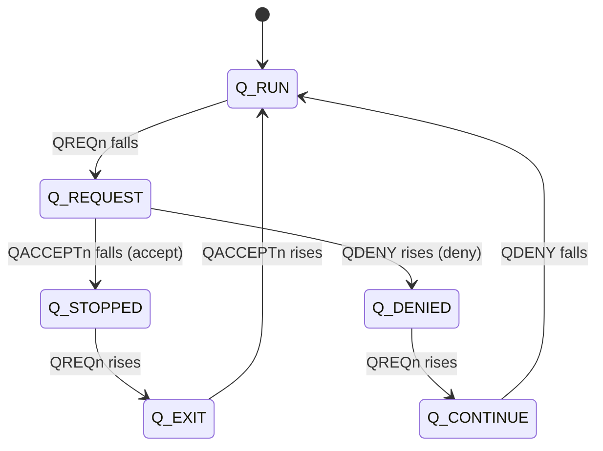

# Q-Channel Power-Management Tracker

A small SystemVerilog verification project for the **AMBA Q-Channel** low-power
handshake. It replaces waveform-hunting with a readable log, catches protocol
violations with assertions, and measures how much of the protocol a test exercised.

| Piece | File | What it does |
|---|---|---|
| Shared definitions | `rtl/q_channel_pkg.sv` | State enum, signal decoder, legal-transition table |
| **SVA checker** | `rtl/q_channel_assertions.sv` | 4 concurrent assertions that flag protocol violations |
| **Tracker** | `rtl/q_channel_tracker.sv` | Logs every signal change + state transition to a table |
| **Functional coverage** | `rtl/q_channel_coverage.sv` | Covergroup: toggles, states, transitions, cross |
| **Testbench** | `tb/tb_top.sv` | Clock/reset, random controller, random device |

## The protocol in one minute

A controller wants to gate a device's clock. It asks; the device accepts or denies.

| Signal | Driven by | Meaning |
|---|---|---|
| `QREQn` | Controller | low = request low power |
| `QACCEPTn` | Device | low = accepted |
| `QDENY` | Device | high = refused |
| `QACTIVE` | Device | high = busy, needs the clock |



State = `{QREQn, QACCEPTn, QDENY}`: RUN=110, REQUEST=010, STOPPED=000, EXIT=100, DENIED=011, CONTINUE=111.
Anything else is illegal.

## Assertions (`q_channel_assertions.sv`)

| ID | Rule |
|---|---|
| A1 | `QACCEPTn` low and `QDENY` high never happen in the same cycle |
| A2 | After `QREQn` falls, it stays low until the device responds |
| A3 | After `QREQn` rises, it stays high until the device is back in `Q_RUN` |
| A4 | The device only starts a response while a request is pending |

## Coverage (`q_channel_coverage.sv`)

- **Toggle**: `QREQn`, `QACCEPTn`, `QDENY`, `QACTIVE` each seen going 0→1 and 1→0
- **States**: all 6 legal states hit; the illegal state is an `illegal_bin`
- **Transitions**: all 7 legal arrows of the state diagram
- **Scenarios**: request→accept and request→deny (allowing wait cycles in `Q_REQUEST`)
- **Cross**: outcome (accepted / denied) × device busy / idle (`QACTIVE`)

## Running

```bash
make verilator            # open-source flow (assertions + tracker + testbench)
make bug                  # device violates the protocol once -> assertions + tracker catch it
make questa|vcs|xrun      # commercial flow, adds functional coverage report
```

Testbench options: `+NUM_TXNS=<n>`, `+ACCEPT_PCT=<n>`, `+INJECT_BUG`.

Verilator 5.020 does not support covergroups, so `make verilator` compiles with
`+define+NO_COVERAGE`. The coverage file was checked for syntax/elaboration with
[slang](https://github.com/MikePopoloski/slang) (0 diagnostics) but its bin counts need a
simulator with covergroup support (Questa, VCS, Xcelium).

## Sample output

`docs/sample_tracker_pass.log` (legal traffic):

```
|       Time | Signal    | New value                 | Direction / Check          |
|     115 ns | QREQn     | 0                         | Controller -> Device       |
|     115 ns | STATE     | Q_RUN -> Q_REQUEST        | OK                         |
|     155 ns | QACCEPTn  | 0                         | Device -> Controller       |
|     155 ns | STATE     | Q_REQUEST -> Q_STOPPED    | OK                         |
```

`docs/sample_tracker_bug.log` (`+INJECT_BUG`): the tracker prints
`Q_REQUEST -> Q_ILLEGAL  *** ILLEGAL TRANSITION ***` and assertion A1 fires.

## Why no interface?

The protocol has only four wires and there is no UVM environment, so the three
checkers are plain modules with ports. An `interface` becomes worthwhile once a
UVM driver/monitor needs a virtual-interface handle. The assertion module can also be
attached to an existing design without editing it:

```systemverilog
bind my_dut q_channel_assertions u_q_chk (.clk(clk), .rst_n(rst_n),
     .qreqn(qreqn), .qacceptn(qacceptn), .qdeny(qdeny), .fail_count());
```

## Why the tracker and the assertions both exist

Assertions **stop the bug** at the moment it happens. The tracker **explains the
sequence** around it. Together you see *that* it broke and *how the signals got there*.

## Note on QACTIVE

In this testbench the device toggles `QACTIVE` randomly and answers requests randomly.
A real controller would check `QACTIVE` before requesting and a real device would deny
when busy; the checkers themselves only watch the wires, so they are unaffected.
