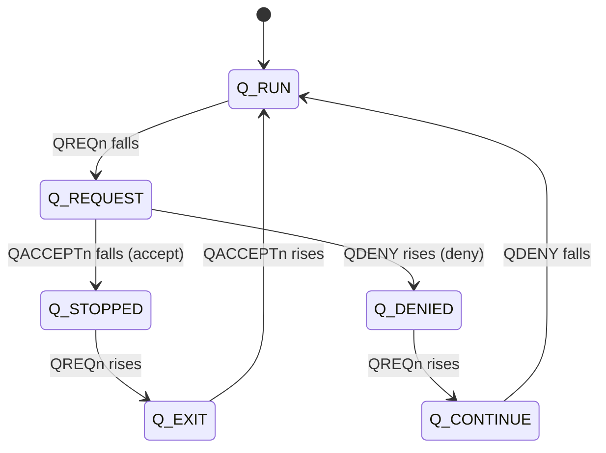

# Q-Channel Power-Management Tracker

A SystemVerilog verification project for the **AMBA Q-Channel** low-power
handshake. It replaces waveform-hunting with a readable log, catches protocol
violations with assertions, measures how much of the protocol a test exercised,
and cross-checks its own log against the raw waveform.

| Piece | File | What it does |
|---|---|---|
| Shared definitions | `rtl/q_channel_pkg.sv` | State enum, signal decoder, legal-transition table |
| **SVA checker** | `rtl/q_channel_assertions.sv` | 4 concurrent assertions that flag protocol violations |
| **Tracker** | `rtl/q_channel_tracker.sv` | Logs every signal change + state transition to a table |
| **Functional coverage** | `rtl/q_channel_coverage.sv` | Covergroup: toggles, states, transitions, cross |
| **Testbench** | `tb/tb_top.sv` | Clock/reset, clocked controller FSM, clocked device FSM |
| **Independent checker** | `scripts/verify_against_vcd.py` | Re-derives ground truth from a VCD and diffs it against the log |

## The protocol in one minute

A controller wants to gate a device's clock. It asks; the device accepts or denies.

| Signal | Driven by | Meaning |
|---|---|---|
| `QREQn` | Controller | low = request low power |
| `QACCEPTn` | Device | low = accepted |
| `QDENY` | Device | high = refused |
| `QACTIVE` | Device | high = busy, needs the clock |



State = `{QREQn, QACCEPTn, QDENY}`: RUN=110, REQUEST=010, STOPPED=000, EXIT=100, DENIED=011, CONTINUE=111.
Anything else is illegal.

## Assertions (`q_channel_assertions.sv`)

| ID | Rule |
|---|---|
| A1 | `QACCEPTn` low and `QDENY` high never happen in the same cycle |
| A2 | After `QREQn` falls, it stays low until the device responds |
| A3 | After `QREQn` rises, it stays high until the device is back in `Q_RUN` |
| A4 | The device only starts a response while a request is pending |

## Coverage (`q_channel_coverage.sv`)

- **Toggle**: `QREQn`, `QACCEPTn`, `QDENY`, `QACTIVE` each seen going 0→1 and 1→0
- **States**: all 6 legal states hit; the illegal state is an `illegal_bin`
- **Transitions**: all 7 legal arrows of the state diagram
- **Scenarios**: request→accept and request→deny (allowing wait cycles in `Q_REQUEST`)
- **Cross**: outcome (accepted / denied) × device busy / idle (`QACTIVE`)

## Running

```bash
make verilator             # build + run (open-source; coverage module is skipped)
make bug                    # device violates the protocol once -> assertions + tracker catch it
make verify                 # build with waveform tracing, then cross-check the log against the VCD
make questa|vcs|xrun         # commercial flow, adds functional coverage report
```

Testbench options: `+NUM_TXNS=<n>`, `+ACCEPT_PCT=<n>`, `+INJECT_BUG`.

Verilator 5.020 does not support covergroups, so `make verilator` compiles with
`+define+NO_COVERAGE`. The coverage file was checked for syntax/elaboration with
[slang](https://github.com/MikePopoloski/slang) (0 diagnostics) but its bin counts need a
simulator with covergroup support (Questa, VCS, Xcelium).

## Results

All numbers below came from real runs (`make verify`, `make bug`, and a 20-seed regression),
not estimates. Raw data: `docs/verification_results.json`.

- **Regression:** 20 random seeds × 100 transactions each (2,000 transactions) on legal
  traffic → **0 assertion failures**.
- **Log accuracy, cross-checked against the raw waveform:** `scripts/verify_against_vcd.py`
  independently recomputes, from the VCD alone, which signals changed at every clock edge and
  which state transitions are legal — without using the RTL's own logic — then diffs that
  against the tracker's log.
  - **50/50 signal-change events** matched the waveform exactly (100%).
  - **32/32 logged state transitions** were correctly classified legal/illegal.
- **Bug injection (`+INJECT_BUG`):** assertion `A1` fires and the tracker logs
  `Q_REQUEST -> Q_ILLEGAL *** ILLEGAL TRANSITION ***`, confirming both the checker and the
  tracker catch a real protocol violation.

`docs/waveform_vs_log.png` — the waveform this was checked against (accept path, then deny path):


`docs/sample_tracker_pass.log` (legal traffic):

```
|       Time | Signal    | New value                 | Direction / Check          |
|      45 ns | QREQn     | 0                         | Controller -> Device       |
|      45 ns | STATE     | Q_RUN -> Q_REQUEST        | OK                         |
|      85 ns | QACCEPTn  | 0                         | Device -> Controller       |
|      85 ns | STATE     | Q_REQUEST -> Q_STOPPED    | OK                         |
```

`docs/sample_tracker_bug.log` (`+INJECT_BUG`): the tracker prints
`Q_REQUEST -> Q_ILLEGAL  *** ILLEGAL TRANSITION ***` and assertion A1 fires.

## A race I found and fixed along the way

The controller and device were first written as procedural `initial ... forever @(posedge clk)`
loops using `<= #1` to drive signals. That fixed an earlier problem (Verilator running `<=`
inside `initial` blocks as effectively blocking), but it introduced a subtler one: two
independent `#1`-delayed updates from different processes could land close enough together
that a response occasionally fell in the *same* clock-edge sampling window as the request that
caused it. The tracker faithfully logged what it saw — a direct `Q_DENIED -> Q_RUN` skipping
`Q_CONTINUE` — and correctly flagged it as illegal, since it never happened as two separate
sampled edges. Across 10 seeds × 200 transactions, this hit **25% of legal request cycles**
(45–68 false "illegal" flags per run).

The fix was to rewrite both drivers as single synchronous `always @(posedge clk)` blocks using
plain nonblocking assignments (no `#delay`), with waiting done via internal counters instead of
procedural `@(posedge clk)` loops. Under standard Verilog scheduling, a signal driven by NBA on
edge *N* is only visible to other processes starting at edge *N+1*, never within edge *N* itself
— so a response can never again land in the same window as its trigger. Re-running the same
20-seed regression afterward gave 0 false illegal transitions.

## About the timestamps

The tracker (like the assertions) is a **synchronous sampler**: it looks at the signals
on each rising clock edge. The time it prints is the edge where a new value was first
*sampled*, which is the value a flop in the design would capture. A signal that changes
just after edge N appears in the waveform right after edge N, but is logged at edge N+1.
So log time = waveform time + up to one clock period (10 ns here). That is expected, not a
delay in the code, and the tracker and the assertions always agree with each other.

## Why no interface?

The protocol has only four wires and there is no UVM environment, so the three
checkers are plain modules with ports. An `interface` becomes worthwhile once a
UVM driver/monitor needs a virtual-interface handle. The assertion module can also be
attached to an existing design without editing it:

```systemverilog
bind my_dut q_channel_assertions u_q_chk (.clk(clk), .rst_n(rst_n),
     .qreqn(qreqn), .qacceptn(qacceptn), .qdeny(qdeny), .fail_count());
```

## Why the tracker and the assertions both exist

Assertions **stop the bug** at the moment it happens. The tracker **explains the
sequence** around it. Together you see *that* it broke and *how the signals got there*.

## Note on QACTIVE

In this testbench the device toggles `QACTIVE` randomly and answers requests randomly.
A real controller would check `QACTIVE` before requesting and a real device would deny
when busy; the checkers themselves only watch the wires, so they are unaffected.
